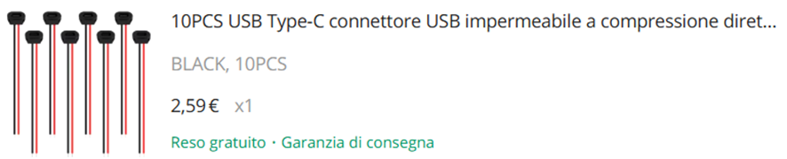
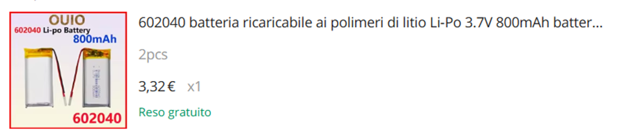

# COSTRUZIONE CASE
# RICEVITORE GNSS UNICORE UM982
Febbraio 2025

Un “lavoretto” abbastanza lungo iniziato ad aprile 2024, varie prove, varie soluzioni alla fine questo è il risultato in un case in alluminio 80 x 80 x 40 mm:
un ricevitore GNSS UNICORE UM982 che permette la connessione di 2 antenne GNSS, 2 schede Bluetooth HC05 (COM1 e COM2), un Datalog di backup automatico dei messaggi inviati alla porta COM, una batteria Lipo 3,7V 2500mAh con scheda di ricarica e unità di Step-Up a 5V che garantisce una autonomia di 4 ore con connessione USB esterna di  ricarica/supporto.

Come mai ho scelto di utilizzare questo tipo di scheda GNSS? 

https://en.unicore.com/products/dual-antenna-gnss-um982/

Innanzi a tutto il prezzo, un vero “Low-Cost” , ma anche la qualità e le caratteristiche veramente innovative. Devo dire che mi interessava scoprire cosa può fare un dispositivo GNSS dual-antenna, il cui utilizzo “principe” è nell’agricoltura di precisione con hardware e software di assistenza alla guida.
https://github.com/AgOpenGPS-Official/AgOpenGPS

Preciso subito per coloro che sono interessati alle sole funzioni topografiche, survey e mapping è consigliato l’altro modello singola antenna UM980 o il più sofisticato UM981 con IMU incorporata.

Si tratta comunque di dispositivi in grado di ricevere i segnali Galileo E6B e quindi accedere ai servizi Galileo HAS che permettono/permetteranno precisioni planimetriche inferiori ai 20 cm e precisioni altimetriche inferiori ai 40 cm. 

Il tutto dipenderà molto dal firmware presente nella scheda GNSS ed ai futuri sviluppi ed aggiornamenti.

Il servizio Galileo High Accuracy Service (HAS) fornisce  l'accesso gratuito , tramite il segnale Galileo (E6-B) e tramite mezzi terrestri (Internet), alle informazioni necessarie per stimare una soluzione di posizionamento accurata utilizzando un algoritmo di posizionamento preciso in tempo reale. 

https://www.gsc-europa.eu/galileo/services/galileo-high-accuracy-service-has

Alcune immagini in fase di realizazione:

Ho realizzato ulteriormente una “barra GNSS” dotata di 2 antenne che aggancio alla barra portatutto della mia autovettura per testare le prestazioni e precisioni in HEADING MODE:
---- immagine ------

Configurazione UM982:

<pre><i>$command,CONFIG,response: OK*54
$CONFIG,ANTENNA,CONFIG ANTENNA POWERON*7A
$CONFIG,NMEAVERSION,CONFIG NMEAVERSION V410*47
$CONFIG,RTK,CONFIG RTK TIMEOUT 600*69
$CONFIG,RTK,CONFIG RTK RELIABILITY 3 1*76
$CONFIG,PPP,CONFIG PPP TIMEOUT 120*6C
$CONFIG,PPP,CONFIG PPP ENABLE E6 HAS*01
$CONFIG,PPP,CONFIG PPP CONVERGE 10 15*20
$CONFIG,HEADING,CONFIG HEADING RELIABILITY 3*67
$CONFIG,HEADING,CONFIG HEADING FIXLENGTH*6F
$CONFIG,HEADING,CONFIG HEADING LENGTH 150.60 0.50*3F
$CONFIG,DGPS,CONFIG DGPS TIMEOUT 600*69
$CONFIG,RTCMB1CB2A,CONFIG RTCMB1CB2A ENABLE*25
$CONFIG,ANTENNADELTAHEN,CONFIG ANTENNADELTAHEN 0.0000 0.0000 0.0000*3A
$CONFIG,SBAS,CONFIG SBAS ENABLE EGNOS*55
$CONFIG,PPS,CONFIG PPS ENABLE GPS POSITIVE 500000 1000 0 0*6E
$CONFIG,SIGNALGROUP,CONFIG SIGNALGROUP 3 6*01
$CONFIG,ANTIJAM,CONFIG ANTIJAM AUTO*2B
$CONFIG,AGNSS,CONFIG AGNSS DISABLE*70
$CONFIG,BASEOBSFILTER,CONFIG BASEOBSFILTER DISABLE*70
$CONFIG,LOGSEQ,CONFIG LOGSEQ 1*15
$CONFIG,COM1,CONFIG COM1 115200*23
$CONFIG,COM2,CONFIG COM2 115200*23
$CONFIG,COM3,CONFIG COM3 115200*23
</i></pre>

<pre><i>$command,UNILOGLIST,response: OK*4A
#UNILOGLIST,92,GPS,FINE,2353,142915000,0,0,18,296;
23
GNGGA COM1 1 	  GNGGA COM2 1 	  GNGGA COM3 1
GPGSA COM1 1 	  GPGSA COM2 1 	    GPGSA COM3 1
GNGSV COM1 1 	  GNGSV COM2 1 	    GNGSV COM3 1
GNRMC COM1 1 	  GNRMC COM2 1 	    GNRMC COM3 1
GPVTG COM1 1 	  GPVTG COM2 1 	    GPVTG COM3 1
GPZDA COM1 1 	  GPZDA COM2 1 	    GPZDA COM3 1
GPGST COM1 1 	  GPGST COM2 1 	    GPGST COM3 1
AGRICA COM1 1 
PVTSLNA COM1 1  
</i></pre>

<pre><i>$command,versiona,response: OK*45
#VERSIONA,92,GPS,FINE,2353,143029000,0,0,18,746;"UM982","R4.10Build13495","HRPT00‑S10C‑P",
  "2310415000012‑LR23A1224506723","ff3bdb9914dca7db","2024/04/02"*68ebfbd8
</i></pre>

Per sperimentare l’utilizzo del ricevitore GNSS UM982 ho altresì sviluppato un’interfaccia in PyGis per la lettura dei messaggi satellitari ( tuttora in fase di sviluppo e test ) che potrebbe diventare in futuro un plugin di QGis o se riesco implementare il tutto nell’attuale interfaccia GNSS presente in QGis.  

Per chi volesse replicare il dispositivo , di seguito troverete l'elenco dei materiali utilizzati:

|Foto |Link  |
|---|---|
| [01_um982](https://it.aliexpress.com/item/1005006356627581.html ) |
|| [02_dissipatori](https://it.aliexpress.com/item/4000348002518.html ) |
|| [03_cavetti_antenne_gnss](https://it.aliexpress.com/item/1005004620858652.html ) |
|| [04_case_AL](https://it.aliexpress.com/item/1005006828775169.html ) |
|| [05_cavetti_x_bluetooth](https://it.aliexpress.com/item/1005006389290211.html ) |
|| [06_connettori_angolari_COM1_2_UM982](https://it.aliexpress.com/item/1005005288629414.html ) |
|| [07_giunzione_bluetooth](https://it.aliexpress.com/item/1005007617385129.html ) |
|| [08_interruttore_bluetooh](https://it.aliexpress.com/item/32966597068.html ) |
|| [09_bluetooth_HC05](https://it.aliexpress.com/item/32817137671.html ) |
|| [10_caricabatteria](https://it.aliexpress.com/item/32798858483.html ) |
|| [11_DC-DC_boster_step_up_alimentazione_UM982](https://it.aliexpress.com/item/1005003203922131.html ) |
|| [12_batteria_3.7V_2500mAh](https://it.aliexpress.com/item/1005006745853422.html ) |
|| [13_datalog](https://it.aliexpress.com/item/1005001351187842.html ) |
|| [14_Micro_SD_32GB](https://it.aliexpress.com/item/32691928032.html ) |
|| [15_nastro_dielettrico](https://it.aliexpress.com/item/1005005058190496.html ) |
|| [16_Connettore_Type-C_v1](https://it.aliexpress.com/item/1005007148475800.html ) |
|| [17_Connettore_Type-C_v2](https://it.aliexpress.com/item/1005006477416745.html ) |
|| [18_interrutore_generale](https://it.aliexpress.com/item/1005006495091965.html ) |
|| [19_guida_luce_led](https://it.aliexpress.com/item/1005006150875834.html ) |
|| [20_distanziatori](https://it.aliexpress.com/item/32862529967.html ) |
|| [21_dadi_1-4](https://it.aliexpress.com/item/1005001917849687.html ) |
|| [22_adattatore_5-8_1-4](https://it.aliexpress.com/item/1005005936639212.html ) |
|| [23_splitter_gnss](https://it.aliexpress.com/item/1005005753608505.html ) |
|| [24_connettore_sma](https://it.aliexpress.com/item/1005006603346164.html ) |
|| [25_cavo_adattatore_usb](https://it.aliexpress.com/item/1005006203091645.html ) |
|| [26_antenne_gnss](https://it.aliexpress.com/item/1005003069610289.html ) |
|| [27_cavo_sma_3m](https://it.aliexpress.com/item/1005003069610289.html ) |
|| [28_cavo_sma_5m](https://it.aliexpress.com/item/1005006413671801.html ) |
|| [29_manicotto](https://it.aliexpress.com/item/1005005088472531.html ) |
|| [30_batteria](https://it.aliexpress.com/item/1005007293369749.html ) |
|| [31_batteria](https://it.aliexpress.com/item/1005007520617163.html ) |
|| [32_batteria](https://it.aliexpress.com/item/1005007586902014.html ) |
|| [33_fascette](https://it.aliexpress.com/item/4001271678128.html ) |

